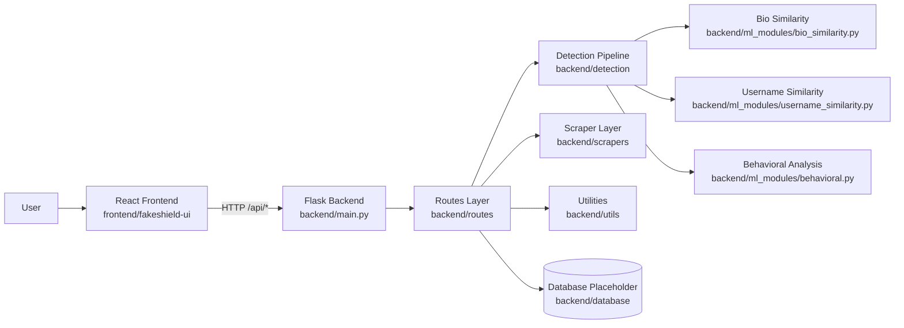
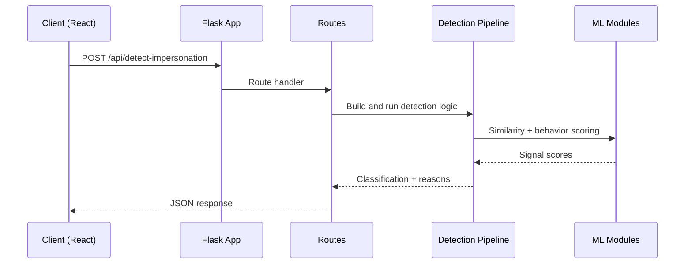

# FakeShield

FakeShield is a full-stack project for detecting suspicious impersonation accounts using profile similarity signals (bio, username, name, and behavioral metrics).

The repository includes:
- A Flask backend API (scan, health, history, report)
- A React frontend dashboard (scan UI, results, history)
- ML helper modules for similarity and behavioral checks
- Dataset and extension folders for future model/data work

## Table Of Contents

1. Overview
2. Repository Structure
3. Architecture
4. Backend
5. Frontend
6. API Endpoints
7. Local Setup
8. Environment Variables
9. Known Gaps And Notes
10. Next Improvements

## Overview

Current flow:
1. User enters a profile URL/username in the frontend.
2. Frontend sends request to backend `/api/detect-impersonation`.
3. Backend currently returns sample/mock suspicious account results.
4. Frontend renders risk summary and detailed findings.

The ML modules in `backend/ml_modules` and detection pipeline in `backend/detection` are present for the real scoring workflow, but the exposed routes currently return mocked payloads.

## Repository Structure

```text
fakeshield/
├─ README.md
├─ backend/
│  ├─ main.py                  # Flask app entry point and middleware/logging
│  ├─ config.py                # Global config and risk thresholds
│  ├─ requirements.txt         # Python dependencies
│  ├─ database/
│  │  └─ __init__.py           # Placeholder for DB connection logic
│  ├─ detection/
│  │  ├─ detector.py           # FakeAccountDetector orchestration
│  │  ├─ reason_converter.py   # Human-readable reason mapping
│  │  └─ __init__.py
│  ├─ ml_modules/
│  │  ├─ bio_similarity.py     # Bio semantic similarity (SentenceTransformer)
│  │  ├─ username_similarity.py# Username fuzzy similarity
│  │  ├─ behavioral.py         # Follower ratio and account-age analysis
│  │  └─ __init__.py
│  ├─ routes/
│  │  └─ __init__.py           # API route registration (health, scan, history, report)
│  ├─ scrapers/
│  │  ├─ instagram_scraper.py  # Instagram scraping helper class
│  │  └─ __init__.py
│  └─ utils/
│     └─ __init__.py           # Common helpers (responses, validation, scoring)
├─ frontend/
│  └─ fakeshield-ui/
│     ├─ package.json
│     ├─ public/
│     └─ src/
│        ├─ App.js
│        ├─ components/
│        │  └─ Navigation.js
│        ├─ pages/
│        │  ├─ Home.js
│        │  ├─ Scan.js
│        │  ├─ Results.js
│        │  └─ History.js
│        ├─ services/
│        │  └─ api.js
│        └─ styles/
├─ dataset/                    # Placeholder for datasets
└─ ml_modules/                 # Top-level placeholder (currently not wired)
```

## Architecture

### High-Level Architecture



### Backend Request Flow



## Backend

### Key Files

- `backend/main.py`
	- Flask app initialization
	- CORS for `/api/*`
	- request/response logging hooks
	- centralized error handlers
- `backend/routes/__init__.py`
	- `GET /api/health`
	- `POST /api/detect-impersonation`
	- `GET /api/results/<scan_id>`
	- `GET /api/history`
	- `POST /api/report`
- `backend/detection/detector.py`
	- Combines bio, username, name, and behavioral signals
	- Classifies as fake if at least 2 signals match
- `backend/detection/reason_converter.py`
	- Converts score thresholds to readable reasons

### Detection Signals

Current design checks:
- Bio semantic similarity
- Username similarity
- Display name similarity
- Follower/following ratio
- Account age recency

## Frontend

### Key Files

- `frontend/fakeshield-ui/src/App.js`
	- Main state container and page switching
	- Backend health polling
	- Scan action orchestration
- `frontend/fakeshield-ui/src/services/api.js`
	- API client and endpoint wrappers
- `frontend/fakeshield-ui/src/pages/*`
	- `Home.js`: intro landing
	- `Scan.js`: input + platform selection form
	- `Results.js`: risk summary and account cards
	- `History.js`: previous scan list
- `frontend/fakeshield-ui/src/components/Navigation.js`
	- Navigation + backend online/offline indicator

## API Endpoints

Base path: `/api`

### `GET /health`
Returns service status and timestamp.

### `POST /detect-impersonation`
Request body:

```json
{
	"profile_url": "@john_doe",
	"platforms": ["instagram", "twitter"]
}
```

Returns scan summary and suspicious account data.

### `GET /results/<scan_id>`
Returns stored or mock result data for a scan ID.

### `GET /history`
Returns prior scan list (currently mock data).

### `POST /report`
Request body:

```json
{
	"username": "john_doe_official",
	"platform": "instagram",
	"reason": "Impersonation"
}
```

Returns report submission status.

## Local Setup

## 1) Backend

```bash
cd backend
python -m venv .venv
```

Windows PowerShell:

```powershell
.\.venv\Scripts\Activate.ps1
```

Install dependencies:

```bash
pip install -r requirements.txt
```

Run backend:

```bash
python main.py
```

## 2) Frontend

```bash
cd frontend/fakeshield-ui
npm install
npm start
```

Default UI URL: `http://localhost:3000`

## Environment Variables

Backend reads environment variables from `.env` (inside `backend/`):

```env
MONGODB_URI=mongodb://localhost:27017
DB_NAME=fakeshield
APIFY_TOKEN=
API_HOST=0.0.0.0
API_PORT=8000
FLASK_DEBUG=True
```

## Known Gaps And Notes

1. Port mismatch by default:
	 - Backend defaults to port `8000` (`backend/main.py`).
	 - Frontend API calls target `8001` (`frontend/fakeshield-ui/src/App.js` and `frontend/fakeshield-ui/src/services/api.js`).
	 - Fix by either setting `API_PORT=8001` in backend `.env`, or updating frontend base URLs.

2. API route data is mostly mocked/static in `backend/routes/__init__.py`.

3. Typo bug in `backend/ml_modules/bio_similarity.py`:
	 - `self.calculase_similarity(...)` should be `self.calculate_similarity(...)`.

4. Some libraries used in code are not listed in `backend/requirements.txt` (for example `sentence-transformers`, `fuzzywuzzy`, `instaloader`).

5. Database and top-level `dataset/` + `ml_modules/` folders are scaffolding placeholders right now.

## Next Improvements

1. Wire routes to real scraper + detector pipeline (replace mocked responses).
2. Align frontend/backend port config through a single environment-based API base URL.
3. Fix typo in bio similarity module and add unit tests for detector outputs.
4. Add persistent storage for scan history and reports.
5. Add authentication and rate limiting policies for production deployment.
