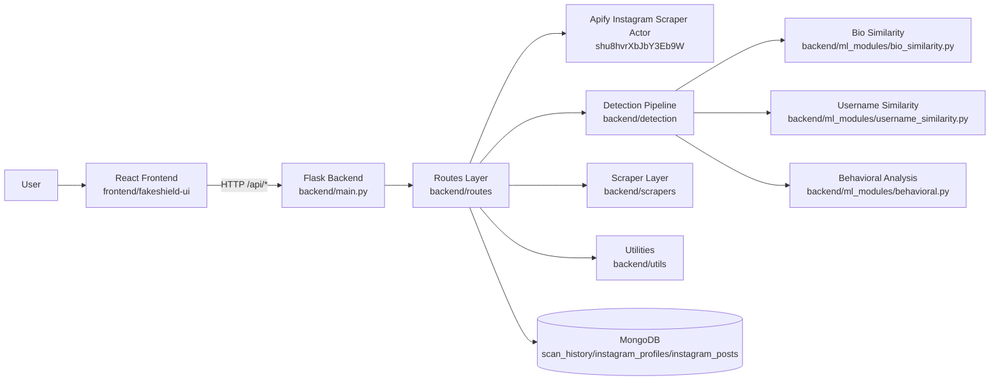
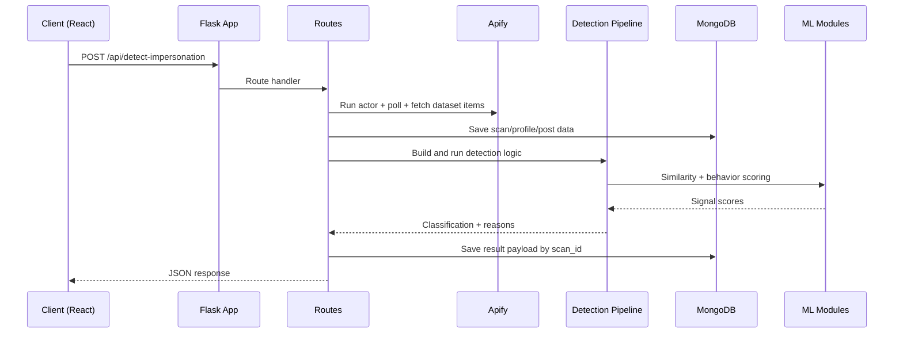

# FakeShield

FakeShield is a full-stack project for detecting suspicious impersonation accounts using profile similarity signals (bio, username, name, and behavioral metrics).

The repository includes:
- A Flask backend API (scan, health, history, report)
- A React frontend dashboard (scan UI, results, history)
- ML helper modules for similarity and behavioral checks
- Apify integration for Instagram profile/post scraping
- MongoDB persistence for scans, profiles, posts, and stored result payloads

## Table Of Contents

1. Overview
2. Repository Structure
3. Architecture
4. Backend
5. Frontend
6. API Endpoints
7. Local Setup
8. Environment Variables
9. Known Gaps And Notes
10. Next Improvements

## Overview

Current flow:
1. User enters a profile URL/username in the frontend.
2. Frontend sends request to backend `/api/detect-impersonation`.
3. Backend normalizes username, builds candidate impersonation usernames, and scrapes via Apify.
4. Backend stores scan data in MongoDB (scan history, profiles, posts, response payload).
5. Detection pipeline scores candidates and classifies risk.
6. Frontend renders risk summary and detailed findings.

History and View Results now load actual stored scan results by `scan_id`.

## Repository Structure

```text
fakeshield/
├─ README.md
├─ backend/
│  ├─ main.py                  # Flask app entry point and middleware/logging
│  ├─ config.py                # Global config and risk thresholds
│  ├─ requirements.txt         # Python dependencies
│  ├─ database/
│  │  └─ __init__.py           # MongoDB client, upserts, scan history/result helpers
│  ├─ detection/
│  │  ├─ detector.py           # FakeAccountDetector orchestration
│  │  ├─ reason_converter.py   # Human-readable reason mapping
│  │  └─ __init__.py
│  ├─ ml_modules/
│  │  ├─ bio_similarity.py     # Bio semantic similarity (SentenceTransformer)
│  │  ├─ username_similarity.py# Username fuzzy similarity
│  │  ├─ behavioral.py         # Follower ratio and account-age analysis
│  │  └─ __init__.py
│  ├─ routes/
│  │  └─ __init__.py           # API routes with scraper + detector + persistence wiring
│  ├─ scrapers/
│  │  ├─ instagram_scraper.py  # Apify actor run/poll/fetch integration
│  │  └─ __init__.py
│  └─ utils/
│     └─ __init__.py           # Common helpers (responses, validation, scoring)
├─ frontend/
│  └─ fakeshield-ui/
│     ├─ package.json
│     ├─ public/
│     └─ src/
│        ├─ App.js
│        ├─ components/
│        │  └─ Navigation.js
│        ├─ pages/
│        │  ├─ Home.js
│        │  ├─ Scan.js
│        │  ├─ Results.js
│        │  └─ History.js
│        ├─ services/
│        │  └─ api.js
│        └─ styles/
├─ dataset/                    # Optional local datasets
└─ ml_modules/                 # Top-level placeholder
```

## Architecture

### High-Level Architecture



### Backend Request Flow



## Backend

### Key Files

- `backend/main.py`
	- Flask app initialization
	- CORS for `/api/*`
	- request/response logging hooks
	- centralized error handlers
	- default backend port aligned to `8001`
- `backend/routes/__init__.py`
	- `GET /api/health`
	- `POST /api/detect-impersonation`
	- `GET /api/results/<scan_id>`
	- `GET /api/history`
	- `POST /api/report`
	- stores full per-scan response payload and returns by `scan_id`
- `backend/scrapers/instagram_scraper.py`
	- Runs Apify actor `shu8hvrXbJbY3Eb9W`
	- Polls run status until success/failure/timeout
	- Fetches dataset items and returns raw profile list
- `backend/database/__init__.py`
	- singleton MongoDB connection
	- upsert profile/post documents
	- create/update scan records
	- save/load result payloads for history view
- `backend/detection/detector.py`
	- Combines bio, username, name, and behavioral signals
	- Classifies as fake if at least 2 signals match
- `backend/detection/reason_converter.py`
	- Converts score thresholds to readable reasons

### Detection Signals

Current design checks:
- Bio semantic similarity
- Username similarity
- Display name similarity
- Follower/following ratio
- Account age recency

Current models/rules:
- SentenceTransformer `all-MiniLM-L6-v2` for bio embeddings
- FuzzyWuzzy ratio for username and name similarity
- Rule thresholds from `backend/config.py`

## Frontend

### Key Files

- `frontend/fakeshield-ui/src/App.js`
	- Main state container and page switching
	- Backend health polling
	- Scan action orchestration
	- View Results now fetches detailed result payload by `scan_id`
- `frontend/fakeshield-ui/src/services/api.js`
	- API client and endpoint wrappers
	- extended request timeout for long-running scans
- `frontend/fakeshield-ui/src/pages/*`
	- `Home.js`: intro landing
	- `Scan.js`: input + platform selection form
	- `Results.js`: risk summary and account cards
	- `History.js`: previous scan list
- `frontend/fakeshield-ui/src/components/Navigation.js`
	- Navigation + backend online/offline indicator

## API Endpoints

Base path: `/api`

### `GET /health`
Returns service status and timestamp.

### `POST /detect-impersonation`
Request body:

```json
{
	"profile_url": "@john_doe",
	"platforms": ["instagram", "twitter"]
}
```

Returns scan summary and suspicious account data.

### `GET /results/<scan_id>`
Returns stored detailed scan result payload for a scan ID.

### `GET /history`
Returns persisted scan history from MongoDB, including `scan_id`, input, timestamp, and found count.

### `POST /report`
Request body:

```json
{
	"username": "john_doe_official",
	"platform": "instagram",
	"reason": "Impersonation"
}
```

Returns report submission status.

## Local Setup

## 1) Backend

```bash
cd backend
python -m venv .venv
```

Windows PowerShell:

```powershell
.\.venv\Scripts\Activate.ps1
```

Install dependencies:

```bash
pip install -r requirements.txt
```

Run backend:

```bash
python main.py
```

## 2) Frontend

```bash
cd frontend/fakeshield-ui
npm install
npm start
```

Default UI URL: `http://localhost:3000`

## Environment Variables

Backend reads environment variables from `.env` (inside `backend/`):

```env
MONGODB_URI=mongodb+srv://<user>:<password>@cluster0.h5dhu2u.mongodb.net/?appName=Cluster0
DB_NAME=fakeshield
APIFY_TOKEN=your_apify_api_token_here
API_HOST=0.0.0.0
 API_PORT=8001
FLASK_DEBUG=True
```

## Known Gaps And Notes

1. Scan runtime depends on Apify actor latency; some requests can take tens of seconds.
2. Existing old mock/test history documents may still appear until replaced by new scans.
3. Current candidate discovery is rule-based username variation generation, not embedding-based nearest-neighbor search.
4. Twitter/LinkedIn in UI are currently placeholders in results unless dedicated scrapers are added.

## Next Improvements

1. Add dedicated historical results page that shows detector raw scores/signals for each fake account.
2. Store candidate-generation metadata and scrape diagnostics for auditability.
3. Add pagination and filtering for history endpoint.
4. Move API base URL to environment config in frontend.
5. Add automated tests for scraper polling, DB persistence, and route contracts.
